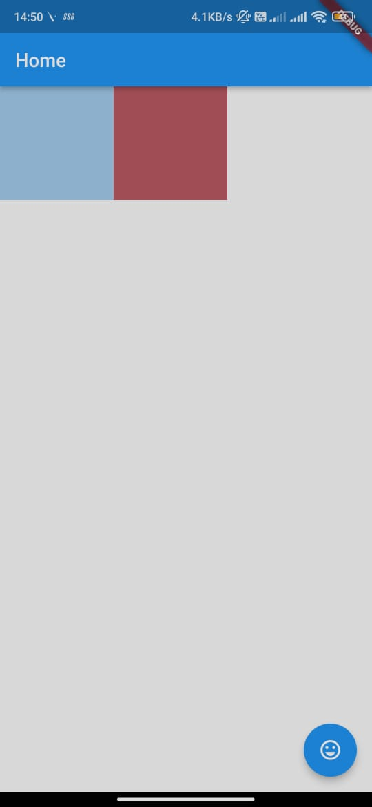
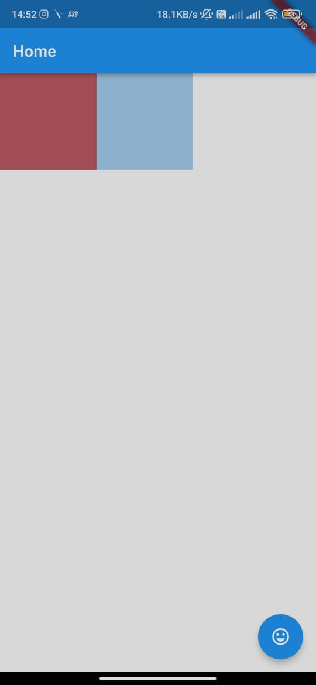

# Assignment007
- This is a flutter app made according to the conditions given in assignment.
- The container get swapped on pressing of the button.
- These containers have background color generated randomly once the app is hot reloaded or app restart.

## Screenshot




## Requirements
- git
- node
- Emulator or physical device

## Setup
- Clone this project ```git clone https://github.com/Captainfast007/assignment.git```
- cd to assignment
- Install dependencies 
- Start the emulator 
- Run the app

